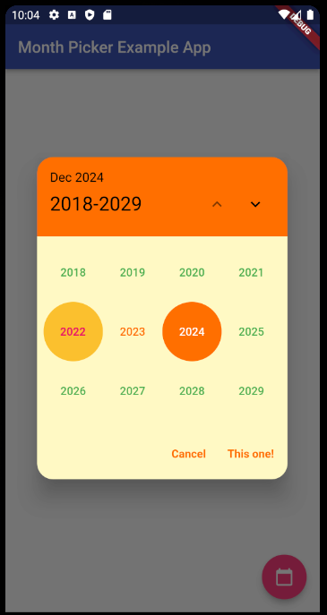
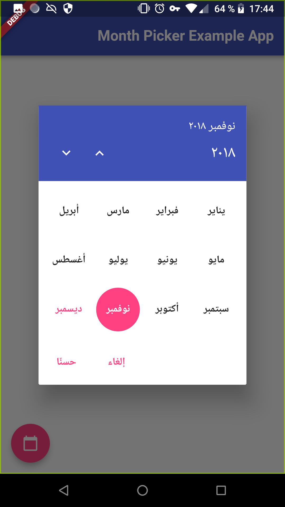

# month_picker_dialog_2
[](https://app.travis-ci.com/Macacoazul01/month_picker_dialog_2)
[](https://pub.dev/packages/month_picker_dialog_2)

Internationalized material style dialog for picking a single month from an infinite list of years.
This package makes use of the intl package and flutter's i18n abilities to provide labels in all languages known to flutter.


[Setting up an internationalized app: the flutter localization package](https://flutter.io/docs/development/accessibility-and-localization/internationalization#setting-up-an-internationalized-app-the-flutter_localizations-package)

## How to use it:

Just add `showMonthPicker()` inside your button function like a normal date picker dialog (context parameter is required):

since 0.6.0 initialDate isn't required anymore!

### Example:

```dart
FloatingActionButton(
    onPressed: () {
        showMonthPicker(
        context: context,
        initialDate: DateTime.now(),
        ).then((date) {
        if (date != null) {
            setState(() {
            selectedDate = date;
            });
        }
        });
    },
    child: Icon(Icons.calendar_today),
),

```

### Parameters list:

There are other parameters to configure on the dialog if you want:

`initialDate` is the initially selected month.

`firstDate` is the optional lower bound for month selection.

`lastDate` is the optional upper bound for month selection.

`selectableMonthPredicate` lets you control enabled months just like the official selectableDayPredicate.

`capitalizeFirstLetter` lets you control if your months names are capitalized or not.

`headerColor` lets you control the calendar header color.

`headerTextColor` lets you control the calendar header text and arrows color.

`selectedMonthBackgroundColor` lets you control the current selected month/year background color.

`selectedMonthTextColor` lets you control the text color of the current selected month/year.

`unselectedMonthTextColor` lets you control the text color of the current unselected months/years.

`confirmText` lets you set a custom confirm text widget.

`cancelText` lets you set a custom cancel text widget.

`customHeight` lets you set a custom height for the calendar widget.

`customWidth` lets you set a custom width for the calendar widget.

`yearFirst` lets you define that the user must select first the year, then the month.

`dismissible` lets you define if the dialog will be dismissible by clicking outside it.

`roundedCornersRadius` lets you define the Radius of the rounded dialog (default is 0).

## Screenshots
### Left-To-Right



### Right-To-Left



## Contributors:
[Dimitri Krivoj](https://github.com/hmkrivoj) (the original creator of the package)

[Fabio Henrique](https://github.com/FabioClem)

This package is a fork of the original month_picker_dialog from https://github.com/hmkrivoj/month_picker_dialog with some updates and fixes.